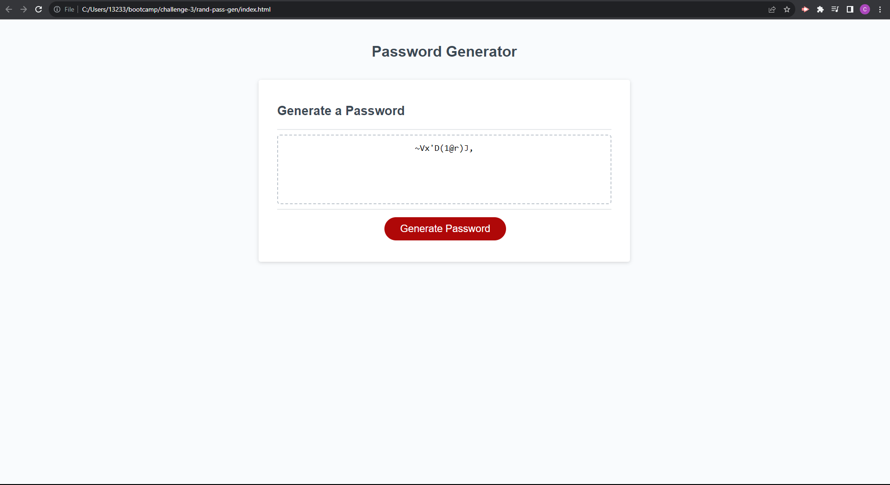

# Random Password Generator

## Description

The purpose of this project is to learn how to create a random password generator. By using JavaScript, this portfolio displays an understanding of how to use JS in order to add logic to a website and create a dynamic application that generates a random password for users. The motivation for this project was to practice using tools in JavaScript to become more proficient in creating dynamic features in a web application. This project solves the issue of learning how JavaScript can be utilized in order to add logic to an application that uses a button feature and generates a random display of characters that can be used as a password.

## Installation

N/A

## Usage 

To use the webpage properly, click the generate button on the screen and answer prompts accordingly. The first window prompt asks users to input a number between 8 and 128 which will correspond to the length of the desired password. After which, users will be asked a series of questions to determine the characters that will be used in the generated password. By clicking "okay," users are accepting the terms of the password whether it be including special characters, numeric characters, etc. After answer all prompts, the text box will display a randomly generated string of characters that users may use as a password. 

## Credits

Instructor Diarmuid Murphy for the inspiration on how to use "if" statements to create an array that will contain the used characters and a "for loop" that will give the user a generated password of the desired length. W3Schools was used as a resource guide on how to properly use the "push" method in JavaScript. Developer Mozilla (MDN) gave instruction on how the return function works in Javascript to return a value in functions.

## Link(s)

https://chriswaje.github.io/rand-pass-gen/

## Image(s)

